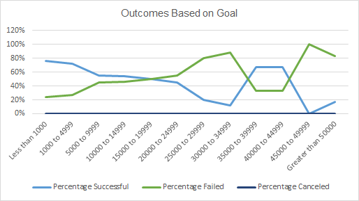

# Kickstarting with Excel

## Overview of Project
The customer's play "Fever" came close to its fundraising goal in a short amount of time. The customer is looking to analyze how different campaigns fared in relation to their launch dates and their funding goals. Using the Kickstarter dataset , we’ll visualize campaign outcomes based on both launch dates and funding goals. 

### Purpose
The project focus on excel mastery with a large dataset. The purpose is to visualize campaign outcomes based on the respective launch dates and funding goals. In conclusion, indepth analysis is provided.

## Analysis and Challenges

### Analysis of Outcomes Based on Launch Date

The chart below shows the outcome of the campaign based on the initial goal.

- Two conclusions are considered on the Outcomes based on Launch Date as follows:

1. Campaign in May through June is more impactfull and its successsful rate is more than 100% compared to campaign conducted throughout end of year in December.
2. Theather is the most profitable campaign category compared to others. it has the most successfull rate if conducted in a specific period of time.

### Analysis of Outcomes Based on Goals

The chart below shows the outcome of the campaign based on the initial goal.

- Conclusions of the Outcomes based on Goals
1. The failure rate is important. Pledged vs goals are disparate. We noticed that when an amount starts increasing above $1000, a reverse outcome is recorded on the pledged amount. We also noticed a 100% failure rate for amount above $50000.
2. By filtering *plays*, the above situation still reflecting. The goal amount must be maintained below the $5000 treshold to be successful.

### Challenges and Difficulties Encountered

## Limitations of dataset

1. Missed broad analysis of the insights based on other countries to compare with the targeed sample.
2. Lack of data on other categories than theater.
3. Lack of data on subcategory under the theater category.

## Recommendation

1. Historical trends for similar campaign. The graph could display perfomance of similar trends to allow the customer to plan goals efficiently.
2. Failure rate in other countries and based on different category and subcategory 
Descriptive analytics table to determine the mean and central tendency. Having an average target could be impact the analyzis.
3. Box and Whisker table. This graph should highlight the minimum goal to look after for a specific category of theater to be considered successful.
